# TUIMM — Your AI Engineering Team

What if you could type "solve DIS-1234" and an AI agent reads the Jira ticket, understands the codebase, writes the code, runs the tests, creates the MR, and updates the ticket — all in one conversation?

That's what TUIMM does.

TUIMM is a set of AI agents built for TUI Musement's frontend teams. They plug into Kiro CLI and connect to the tools you already use: Jira, GitLab, SonarQube, Datadog, Figma, Contentful, ConfigCat, Confluence. Nine specialist agents, each one focused on a specific part of the workflow. You talk to the expert you need, and it handles the rest.

No dashboards to check. No context switching. No copy-pasting between tools.

---

## What can it do?

Here are some real examples:

```
You: "solve DIS-1234"
→ Agent reads the ticket, plans the implementation, writes code, creates the MR, moves the ticket to In Review.

You: "review MR 242"
→ Agent fetches the diff, checks SonarQube, reviews against the team's checklist, posts comments on GitLab.

You: "scan production errors"
→ Agent queries Datadog, groups errors by pattern, flags new issues, compares with known patterns.

You: "find stale feature flags"
→ Agent audits ConfigCat, cross-references with the codebase, produces a cleanup plan.

You: "design the new search architecture"
→ Agent analyzes the codebase, produces a technical design doc, breaks it into Jira tickets.
```

Every agent knows our conventions — branch naming, commit format, BEM, Vue patterns, testing standards. It's not a generic AI assistant. It's one that knows how we work.

---

## The agents

Two tiers. You talk to Tier 1. Tier 1 talks to Tier 2 behind the scenes.

```mermaid
graph TB
    Dev(["👤 Developer<br/>kiro-cli"])

    Dev --> Default["Default<br/><i>concierge</i>"]
    Dev --> AgDev["Dev<br/><i>ticket → MR</i>"]
    Dev --> MR["MR<br/><i>review & approve</i>"]
    Dev --> QG["Quality Guardian<br/><i>quality, debt, deps</i>"]
    Dev --> Obs["Observability<br/><i>errors, monitoring</i>"]
    Dev --> DevEx["DevEx<br/><i>flags, i18n, content</i>"]
    Dev --> DS["Design System<br/><i>Figma ↔ code</i>"]
    Dev --> Kn["Knowledge<br/><i>docs, runbooks</i>"]
    Dev --> Plan["Planner<br/><i>design, tasks</i>"]

    AgDev --> Jira["🔌 Jira"]
    AgDev --> GitLab["🔌 GitLab"]
    AgDev --> CodeRev["🔌 Code Reviewer"]
    MR --> GitLab
    MR --> Sonar["🔌 SonarQube"]
    MR --> CodeRev
    QG --> Sonar
    QG --> GitLab
    Obs --> DD["🔌 Datadog"]
    DevEx --> CC["🔌 ConfigCat"]
    DevEx --> Contentful["🔌 Contentful"]
    DS --> Figma["🔌 Figma"]
    Kn --> Confluence["🔌 Confluence"]
    Plan --> Jira
    Plan --> Nuxt["🔌 Nuxt docs"]
    Default --> Jira

    style Dev fill:#e1f5fe,stroke:#0288d1
    style Default fill:#fff3e0,stroke:#f57c00
    style AgDev fill:#fff3e0,stroke:#f57c00
    style MR fill:#fff3e0,stroke:#f57c00
    style QG fill:#fff3e0,stroke:#f57c00
    style Obs fill:#fff3e0,stroke:#f57c00
    style DevEx fill:#fff3e0,stroke:#f57c00
    style DS fill:#fff3e0,stroke:#f57c00
    style Kn fill:#fff3e0,stroke:#f57c00
    style Plan fill:#fff3e0,stroke:#f57c00
    style Jira fill:#e8f5e9,stroke:#388e3c
    style GitLab fill:#e8f5e9,stroke:#388e3c
    style Sonar fill:#e8f5e9,stroke:#388e3c
    style DD fill:#e8f5e9,stroke:#388e3c
    style Figma fill:#e8f5e9,stroke:#388e3c
    style CC fill:#e8f5e9,stroke:#388e3c
    style Contentful fill:#e8f5e9,stroke:#388e3c
    style Confluence fill:#e8f5e9,stroke:#388e3c
    style CodeRev fill:#e8f5e9,stroke:#388e3c
    style Nuxt fill:#e8f5e9,stroke:#388e3c
```



**Orange** = Tier 1 (you talk to these) · **Green** = Tier 2 subagents (API connectors)

**Tier 1 — The specialists** (you invoke these directly)

| Agent | What it does |
|-------|-------------|
| **Default** | Don't know where to start? Ask here. It knows what every agent can do and points you to the right one |
| **Dev** | Ticket-to-MR in one conversation. Reads Jira, plans, codes, tests, commits, creates MR |
| **MR** | Reviews merge requests. Structured feedback with severity levels. Can approve, comment, rebase |
| **Quality Guardian** | SonarQube analysis, tech debt tracking, dependency audits, release management |
| **Observability** | Datadog log analysis, production error investigation, incident patterns |
| **DevEx** | Feature flags, translations (Weblate), content models, sprint workflow |
| **Design System** | Figma-to-code alignment, component governance, design token audits |
| **Knowledge** | Confluence health checks, runbook generation, onboarding guides |
| **Planner** | Technical design documents, task decomposition, cross-domain analysis |

**Tier 2 — The tool connectors** (agents call these, you don't)

Jira · Confluence · GitLab · SonarQube · Datadog · Figma · Contentful · ConfigCat · Nuxt docs · Code Reviewer

Each one wraps a single API via MCP (Model Context Protocol). They execute — they don't decide. The intelligence lives in Tier 1.

---

## Quick start

### 1. Copy the files

Run from the `tuimm/` directory:

```bash
mkdir -p ~/.kiro/agents ~/.kiro/steering ~/.kiro/skills ~/.kiro/tuimm

cp agents/*.json ~/.kiro/agents/
cp steering/TUIMM_*.md ~/.kiro/steering/
cp -r steering/scripts ~/.kiro/steering/
cp -r skills/tuimm-* ~/.kiro/skills/
cp tuimm/README.md ~/.kiro/tuimm/
```

The `TUIMM_` and `tuimm-` prefixes prevent collisions with personal or other package files in the shared `~/.kiro/` directories.

### 2. Set up your credentials

Each developer uses their own API tokens. No shared accounts, no centralized server.

Open **[SETUP.md](tuimm/SETUP.md)** — it has the full list with URLs where to get each token. The short version:

| Service | What you need |
|---------|--------------|
| GitLab | Personal access token |
| Datadog | API key + App key |
| SonarQube | API token (VPN required) |
| Figma | Personal access token |
| Contentful | CMA token |
| ConfigCat | API user + password |
| Jira / Confluence | Nothing — OAuth via browser, automatic |
| Nuxt docs | Nothing — public endpoint |

Add the env vars to your `~/.bashrc` or `~/.zshrc`. They need to be exported before starting Kiro CLI.

### 3. Verify

```bash
kiro-cli --agent tuimm_default --classic
```

> **Note:** Use the `--classic` flag. Kiro CLI 2.0 asks for permission before each subagent call, which breaks the workflow — agents delegate to subagents constantly and it should be automatic. We're working on a proper fix. In the meantime, `--classic` skips the confirmation prompts.

Type `$get-commands`. If you see 40 commands across 9 agents, you're good.

---

## How to use it

Start with the agent that matches what you need:

| I want to... | Agent | Command |
|--------------|-------|---------|
| Solve a Jira ticket | `tuimm_dev` | `$dev_solve DIS-1234` |
| Continue previous work | `tuimm_dev` | `$dev_continue` |
| Review an MR | `tuimm_mr` | `$mr_review 242` |
| Check my open MRs | `tuimm_mr` | `$mr_list` |
| Scan production errors | `tuimm_observability` | `$obs_dd-scan` |
| Investigate a specific error | `tuimm_observability` | `$obs_dd-investigate` |
| Check code quality | `tuimm_quality_guardian` | `$qg_quality-check` |
| Audit dependencies | `tuimm_quality_guardian` | `$qg_dependency-scan` |
| Find stale feature flags | `tuimm_devex` | `$devex_flag-cleanup` |
| Check translation coverage | `tuimm_devex` | `$weblate_coverage` |
| Compare Figma vs code | `tuimm_design_system` | `$ds_component-check` |
| Audit Confluence docs | `tuimm_knowledge` | `$kn_doc-health` |
| Generate a runbook | `tuimm_knowledge` | `$kn_runbook` |
| Design a feature | `tuimm_planner` | `$planner_design` |
| Create a Jira ticket | any agent | `$jira_create-ticket` |
| See all commands | any agent | `$get-commands` |

You can also just talk naturally. "I need to review an MR" works as well as `$mr_review 242`.

---

## What's inside the package

```
tuimm/
├── agents/          19 agent configs (→ ~/.kiro/agents/)
├── steering/        11 TUIMM_*.md behavioral rules (→ ~/.kiro/steering/)
│                     + scripts/ session utilities
├── skills/          27 tuimm-* skill directories (→ ~/.kiro/skills/)
│                     13 workflow skills (commands + templates inside)
│                     14 knowledge skills (reference material, some with scripts/)
├── tuimm/           knowledgeBase index (→ ~/.kiro/tuimm/)
├── SETUP.md         credentials guide
└── README.md        package overview
```

**Steering** defines how agents behave: git conventions, communication style, error handling, coding standards. All agents share the same rules — consistency is built in.

**Commands** are step-by-step workflows. When you type `$dev_solve`, the agent reads the command file, follows the steps, delegates to subagents, and formats the output using a template. 40 commands across 11 domains.

**Skills** are reference knowledge. Commit conventions, code review checklists, Weblate workflows, Jira document format. Agents load them when they need specific expertise. Some skills also bundle scripts (autobuild, bg, logd, guidelines-generator) that agents run via shell.

**Scripts** live inside their respective skills under `scripts/` subdirectories, plus `steering/scripts/` for session utilities like workspace cleanup.

---

## Prerequisites

- [Kiro CLI](https://kiro.dev) installed and working
- Node.js 18+ with npx
- Python 3.10+ (for scripts)
- Git with SSH access to `ssh.source.tui`
- VPN for SonarQube
- Linux, WSL, or macOS

---

## Growing with your team

TUIMM ships with the Frontend Guild's knowledge built in, but it's designed to absorb expertise from every team that adopts it.

Some examples of what teams can contribute:

- **Error patterns** — the Observability agent recognizes recurring production errors. Today it knows the frontend ones. When your team adds its own patterns to `skills/known-error-patterns/`, every developer using `$obs_dd-scan` benefits from that knowledge.
- **Coding guidelines** — the guidelines-generator tool extracts conventions from real code. Run it on your repo and the output becomes a skill that agents reference when writing or reviewing code for your project.
- **Nuxt MCP** — teams using Nuxt can enable `nuxt-mcp-dev` (see SETUP.md) to give agents deeper project context: resolved routes, components, module graph. Optional, but makes agents significantly smarter about your specific app.

The more teams contribute, the smarter the agents get for everyone.

---

## Uninstall

```bash
rm ~/.kiro/agents/tuimm_*.json
rm ~/.kiro/steering/TUIMM_*.md
rm -rf ~/.kiro/skills/tuimm-*/
rm -rf ~/.kiro/tuimm/
```

Env vars in your shell config are harmless to leave.

---

## More info

- **[SETUP.md](tuimm/SETUP.md)** — full credentials guide with URLs
- **[AGENTS.md](AGENTS.md)** — technical reference for AI assistants installing the package
- **[ideas/](ideas/)** — architecture proposals and engineering practice specs
- **[docs/](docs/)** — reference documentation about Excellence
